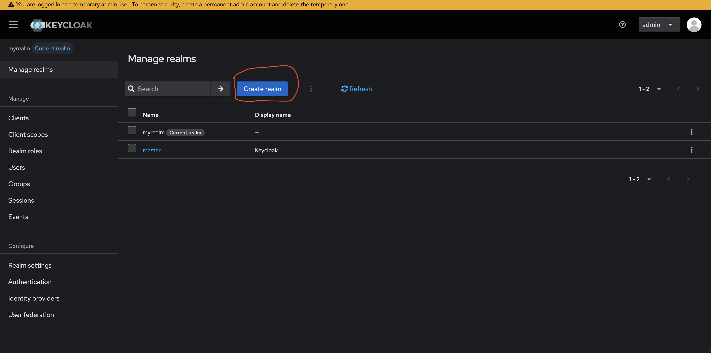
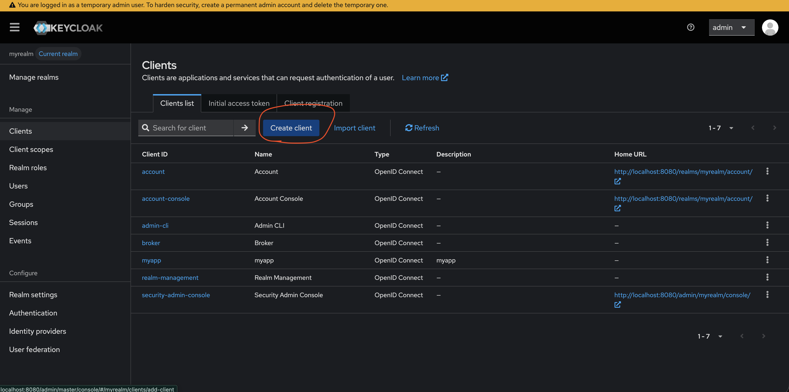
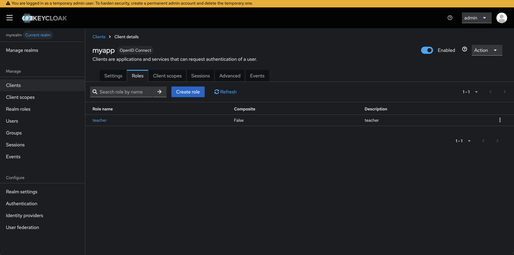
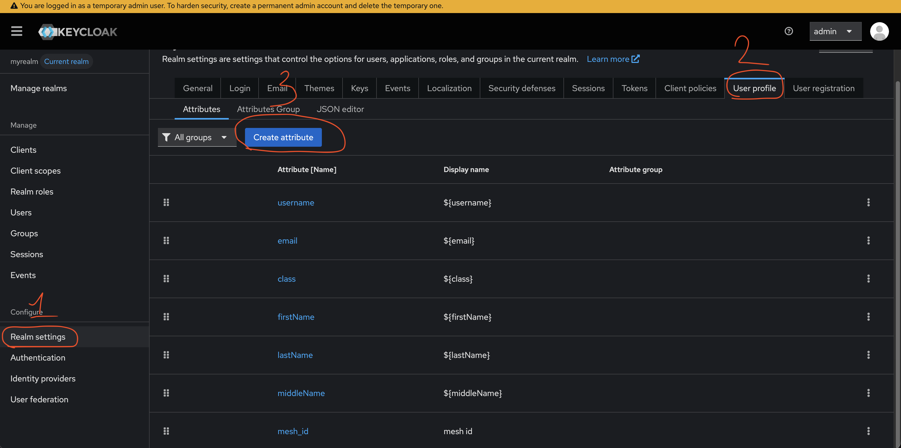
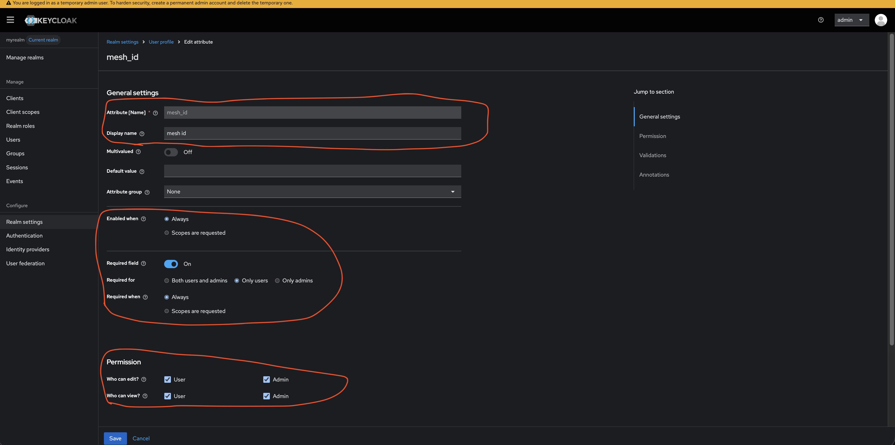
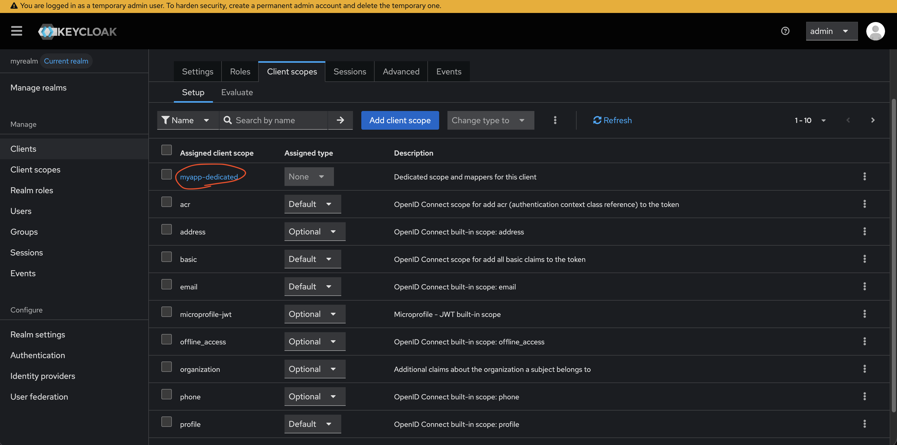
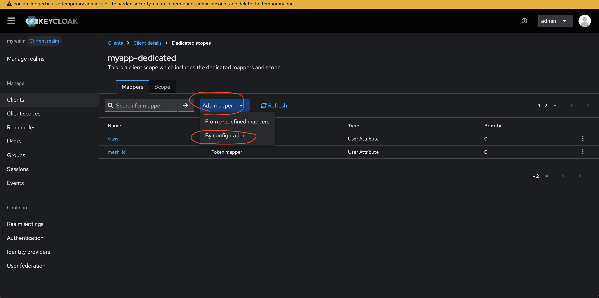
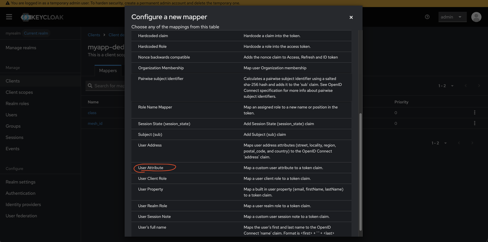
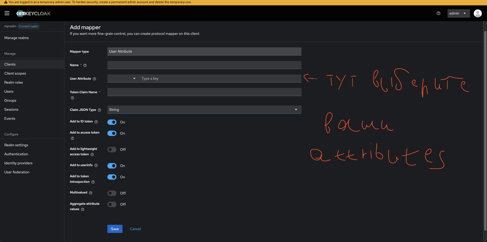

# Запуск

## настройка keycloak

1. запустите кейклок
> [!NOTE]
> можно запустить с помощью докера
> ```bash
> docker run -p 8080:8080 \
> -e KC_BOOTSTRAP_ADMIN_USERNAME=admin \
> -e KC_BOOTSTRAP_ADMIN_PASSWORD=admin \
> quay.io/keycloak/keycloak:latest start-dev
> ```
после этого откройте `localhost:8080`

2. создайте новый realm и назовите myrealm


3. выберите ваш realm и создайте клиента с id: myapp, в valid redirect URIs поставьте /*


4. добавьте роль teacher в ваш myapp


5. добавьте аттрибуты (class, middleName, mesh_id) в realm 


6. создайте все три аттрибута (для class добавьте валидатор, что это число от 5 до 11)


7. создайте mappers для mesh_id и class





## запуск самого сервера

1. клонируйте репозиторий, войдите в папку и установите зависимости
```bash 
git clone https://github.com/silaeder-labs/journal
cd journal
pip install -r requirements.txt
```

2. стартаните базу данных (поменяйте данные о пользователе в `/backend/database/starter/starter.py` на свои)
```bash
python backend/database/starter/starter.py
```

3. получите текущие оценки (создайте файл .env в папке `/backend/workers/mesh_parser`) в .env введите строку `BEARER_TOKEN=YOUR_TOKEN` в YOUR_TOKEN подставьте ваш МЭШ токен БЕЗ Bearer
```bash
python backend/database/marks_update.py
```

4. запустите сервер
```bash
cd backend/main
uvicorn main:app --reload 
```
готово! теперь сервер запущен по адресу `localhost:8080`